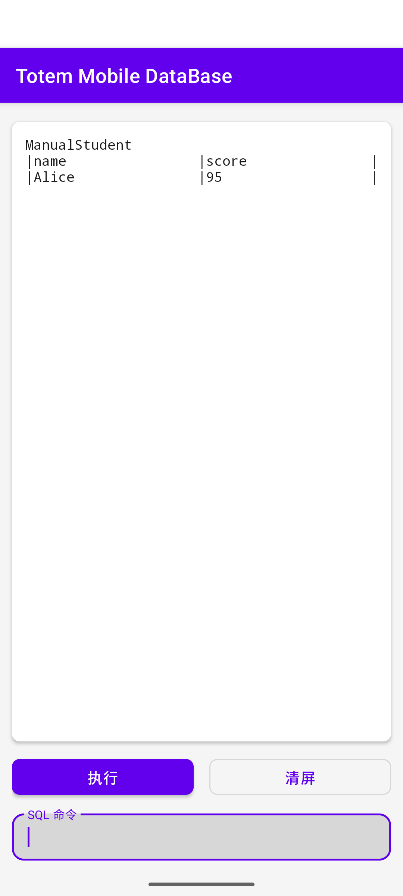
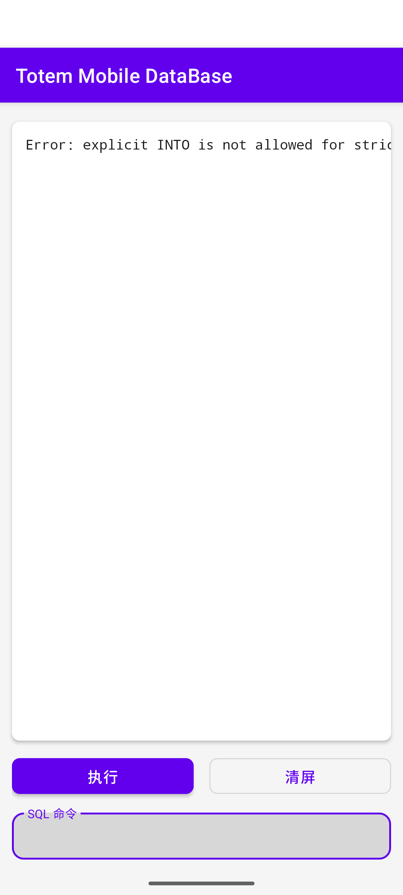
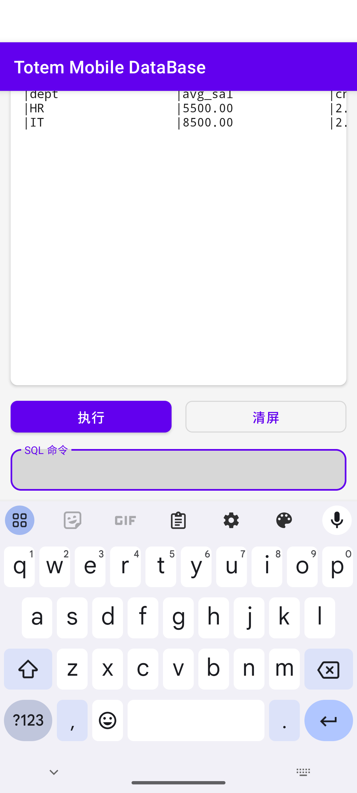
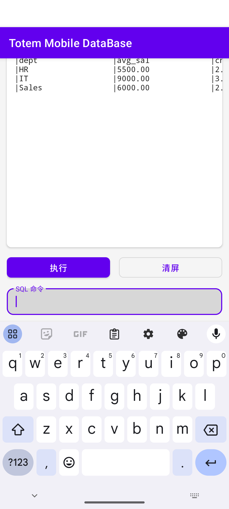
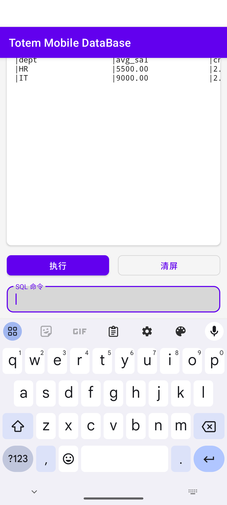
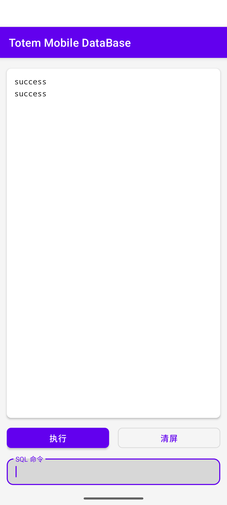

# Totem Mobile DataBase 实验报告

## 一、实验概述

本实验基于 Android 端 Totem 数据库，实现两项代理类功能：

1. 非严格 `SelectDeputy` 的创建、显式插入及更新迁移。
2. `GroupDeputy` 对 `HAVING` 子句的查询、创建及增删改迁移支持。

项目使用 JDK 17、Android SDK API 35 和 Gradle 8.11.1，在 Android 模拟器
`sdk_gphone64_x86_64` 上完成编译、安装和前端演示。

## 二、任务一：非严格 SelectDeputy

### 2.1 设计思路

创建 `SelectDeputy` 时，根据 SELECT 是否包含 `WHERE` 区分模式：

- 包含 `WHERE`：严格模式，由查询规则自动决定代理成员。
- 不包含 `WHERE`：非严格模式，创建时不复制源类数据，只接受显式
  `INSERT ... INTO deputyClass`。

模式写入 `DeputyRuleTableItem.deputyrule[2]`，分别使用 `strict` 和
`non_strict` 标记。数据库重新加载后仍从规则表恢复模式。

显式插入先验证目标代理类确实是源类的非严格代理，再按 SwitchingTable
映射源属性和代理属性，同时写入源元组、代理元组和 BiPointer。DELETE 和
UPDATE 通过 BiPointer 找到已显式关联的代理元组，未关联元组不影响代理类。

### 2.2 关键修改

- `CreateDeputyClassImpl.java`：识别模式，非严格创建时不复制元组。
- `InsertImpl.java`：验证并执行 `INSERT ... INTO deputyClass`。
- `DeleteImpl.java`：删除关联源元组时同步删除代理元组和指针。
- `UpdateImpl.java`：只更新已建立 BiPointer 的非严格代理元组。
- `MemManager.java`：持久化 DeputyRuleTable。

### 2.3 核心流程

```text
CREATE SELECTDEPUTY
  -> 检查 WHERE
  -> strict / non_strict
  -> 保存完整 SELECT 与模式

INSERT ... INTO deputy
  -> 验证源类与代理关系
  -> 拒绝严格代理或无关代理
  -> 插入源元组和代理元组
  -> 创建 BiPointer
```

### 2.4 演示结果

非严格代理显式插入后包含 Alice，源类更新后分数同步为 95：



向严格代理显式插入时返回明确错误：



## 三、任务二：GroupDeputy HAVING

### 3.1 设计思路

HAVING 在 GROUP BY 聚合后、ORDER BY 和 LIMIT 前执行。`Having.java`
对聚合结果求值，并复用 `Where.compare()` 的数值比较逻辑。

GroupDeputy 创建使用 HAVING 过滤后的 `SelectResult`，只插入满足条件的
分组并创建对应 BiPointer，同时将完整 SELECT（含 HAVING）写入规则表。

源数据变化时，`GroupDeputySynchronizer` 重新执行保存的完整规则，以
分组键比较期望状态与现有状态：

- 满足 -> 满足：更新聚合值。
- 不满足 -> 满足：创建代理元组和来源指针。
- 满足 -> 不满足：删除代理元组和指针。
- 分组键变化：分别维护旧组和新组。

该方法也能处理被 HAVING 过滤、当前没有 BiPointer 的分组。

### 3.2 关键修改

- `Having.java`：聚合表达式、别名、逻辑运算和数值比较。
- `SelectImpl.java`：GROUP BY -> HAVING -> ORDER BY -> LIMIT，并支持
  `COUNT(*)`。
- `CreateDeputyClassImpl.java`：保存完整规则和正确的聚合属性映射。
- `GroupDeputySynchronizer.java`：统一维护代理元组与 BiPointer。
- `InsertImpl.java`、`DeleteImpl.java`、`UpdateImpl.java`：数据变化后同步。

### 3.3 核心流程

```text
源类 INSERT / DELETE / UPDATE
  -> 找到关联的 GroupDeputy
  -> 执行 GROUP BY + HAVING 规则
  -> 按分组键对比现有代理元组
  -> 更新 / 创建 / 删除
  -> 重建 BiPointer
```

### 3.4 演示结果

创建时 Sales 被过滤，只保留 HR 和 IT：



插入后 IT 更新为 9000/3，Sales 以 6000/2 进入：



删除后 Sales 退出，IT 仍满足条件：



UPDATE 后源表 id=2 为 3000，HR 退出代理，只保留 IT：



## 四、测试与验证

自动化测试覆盖 HAVING 边界、聚合别名、`COUNT(*)`、单元素分组、最后一条
删除、批量更新、分组键变化、无 HAVING 回归、BiPointer 一致性，以及任务一
的模式、错误输入和持久化。

```text
runRegressionTest: 100 passed, 0 failed
assembleDebug: BUILD SUCCESSFUL
testDebugUnitTest: BUILD SUCCESSFUL
Android emulator install: Success
```

结果区域支持纵向和横向滚动。为避免 Android 新版边到边窗口使第一行被
ActionBar 遮挡，布局增加了顶部避让。

## 五、系统表与实现映射

本实验没有新增系统表，而是复用 Totem 对象代理模型已有的系统表维护依赖关系：

- `DeputyRuleTable` 保存代理规则数组。当前实现将完整 SELECT 规则写入 `deputyrule[0]`，将代理类型写入 `deputyrule[1]`；对 SelectDeputy 额外在 `deputyrule[2]` 中保存 `strict` 或 `non_strict`，用于区分严格和非严格模式。
- `SwitchingTable` 维护源属性到代理属性的映射。非严格 SelectDeputy 显式插入时，系统根据该表把源元组属性投影到代理类；UPDATE 迁移时也依赖该映射同步代理属性。
- `BiPointerTable` 维护源元组和代理元组之间的对应关系。显式进入非严格 SelectDeputy 的源元组会创建 BiPointer；DELETE 和 UPDATE 通过该指针找到需要同步维护的代理元组。
- GroupDeputy HAVING 同步依赖 `DeputyRuleTable` 中保存的完整 SELECT 规则重新计算期望分组，再删除、更新或创建代理元组，并重建对应的 BiPointer。

因此，任务一的核心是让非严格代理只在显式 `INSERT ... INTO deputyClass` 时建立元组和指针；任务二的核心是让 HAVING 过滤后的 GroupDeputy 结果与 BiPointerTable 始终保持一致。

## 六、基于原始工程 diff 的实现确认

二次审计时发现当前仓库与原始工程没有共同 merge base，因此采用两点树对树 diff 对比 `base/master` 与当前 HEAD。核心变化集中在以下文件：

- `CreateDeputyClassImpl.java`：识别 SelectDeputy 的 strict / non_strict 模式，非严格创建时不复制历史数据，并保存完整代理规则。
- `InsertImpl.java`：读取第二个 `INTO deputyClass`，校验非严格同源代理，执行显式插入并创建 BiPointer；同时避免普通 INSERT 自动传播到非严格代理。
- `DeleteImpl.java`：删除源元组后清理相关代理元组和 BiPointer，并触发 GroupDeputy 同步。
- `UpdateImpl.java`：通过 BiPointer 和 SwitchingTable 同步已关联代理元组，并在源类更新后触发 GroupDeputy 同步。
- `SelectImpl.java`：在 GROUP BY 聚合后、ORDER BY / LIMIT 前接入 HAVING，补充 `COUNT(*)` 聚合处理，并支持 HAVING 中未投影的聚合表达式。
- `Having.java`：实现 HAVING 表达式求值，覆盖任务示例中的 AVG、COUNT、别名和比较运算。
- `GroupDeputySynchronizer.java`：新增 GroupDeputy 全量重算同步器，负责按 HAVING 后的结果更新代理元组和重建 BiPointer。
- `RegressionTest.java`：补充任务一、任务二、边界条件和 BiPointer 一致性回归。
- `ExtremeInputTest.java`：补充非法输入、错误显式 INTO 和较大数据量下的稳定性场景。

## 七、已知限制与风险

- `GroupDeputySynchronizer` 当前采用全量重算方案。优点是实现简单、能覆盖被 HAVING 过滤而没有现存 BiPointer 的分组；缺点是性能较粗，数据量大时不如按受影响分组增量维护。
- 已补充支持 HAVING 中未投影的聚合表达式，覆盖 `AVG`、`COUNT`、`SUM`、`MIN`、`MAX` 等任务相关聚合函数；最终 SELECT 或 GroupDeputy 结果不会泄漏内部隐藏列。
- HAVING 支持覆盖任务书和 README/todo 中的验收示例及上述加分场景，但不是完整 SQL HAVING 语义实现。
- GroupDeputy 分组键不是 SELECT 第一列时，当前同步逻辑存在风险，需要进一步验证。
- 显式 `INSERT ... INTO deputyClass` 在插入中途失败时缺少完整事务回滚机制，极端异常下可能需要人工检查源类、代理类和 BiPointer 的一致性。
- 本地 Gradle wrapper 首次运行可能因为网络下载 Gradle 发行包失败。该类失败属于环境或网络问题，不能直接视为源码编译错误。

## 八、本人补充贡献

在已有实现基础上，本人完成了低风险验收材料补充：

- 基于 PDF 任务书、系统介绍、当前 `README.md` / `todo.md`、源码和原始工程 diff 对实现进行了二次审计。
- 新增 [验收SQL.md](验收SQL.md)，整理可在 Android 前端逐条复制执行的验收 SQL。
- 补充成功路径、失败路径和边界场景，覆盖非严格 SelectDeputy 与 GroupDeputy HAVING 的主要验收要求。
- 补充 BiPointerTable / SwitchingTable 一致性观察点，便于演示时解释源类、代理类和系统表之间的关系。
- 补充系统表与实现映射说明，明确 `DeputyRuleTable`、`SwitchingTable`、`BiPointerTable` 在两个任务中的作用。
- 补充已知限制与验收风险说明，区分任务已覆盖能力和仍需进一步验证的非主路径场景。

## 九、AI 工具使用说明

本实验使用 AI 编程工具辅助需求解析、代码检索、实现、回归用例设计、
Gradle/Android 环境调试和报告整理，AI 参与度约为 70%。

需求目标与验收范围由使用者确定。所有结论均经过实际编译、自动化测试或
Android 模拟器执行验证，不以未运行的代码或推测结果作为实验结论。

## 十、提交说明

提交内容包括完整 Android 项目源码、Gradle 配置、README、TODO、实验报告、
演示记录和关键截图。`.gitignore` 排除：

- `references/`
- `tmp/`
- `local.properties`
- `.gradle/`
- 所有 `build/` 目录

